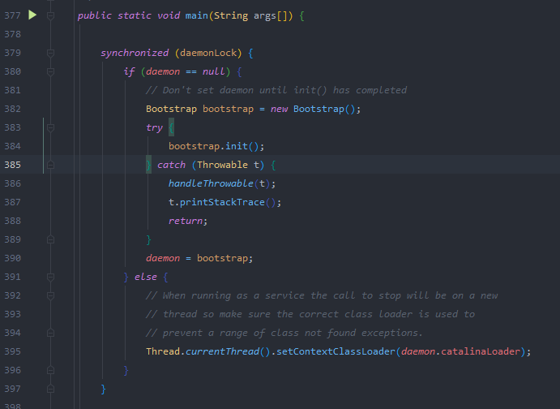
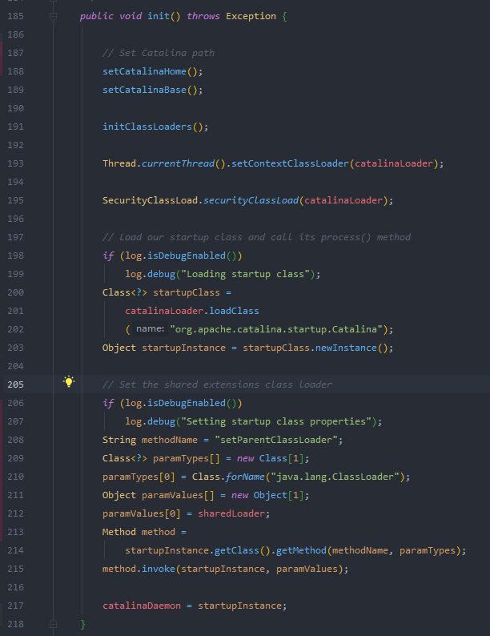
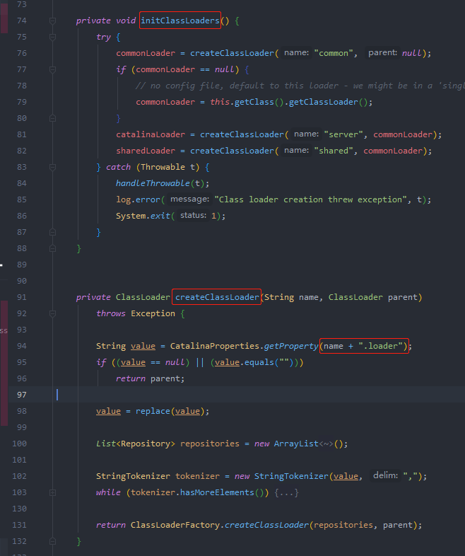
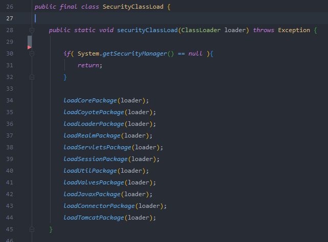
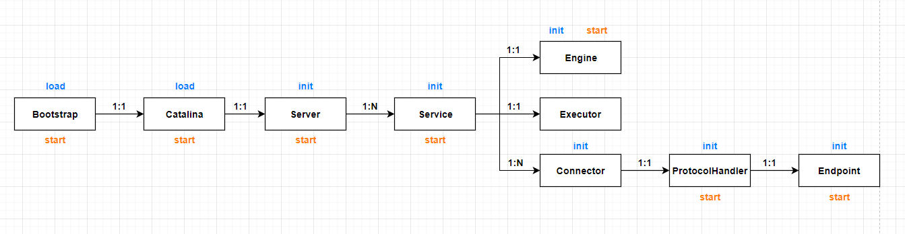
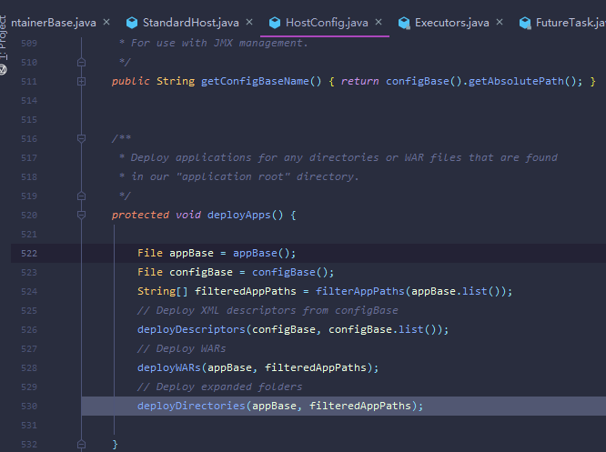

# 启动类 Bootstrap 
 由 org.apache.catalina.startup.Bootstrap 中的main方法开始启动。
## 1. main方法
以线程安全的方式启动deamon守护进程，若已启动则直接设置当前线程的classloader为daemon.catalinaLoader
  
## 2. 启动deamon时首先调用init方法初始化
init方法调用initClassLoaders初始化类加载器，然后将初始化好的catalinaLoader设置到当前线程，接着通过反射调用org.apache.catalina.startup.Catalina类的setParentClassLoader，将sharedLoader传入。

### 2.1  initClassLoaders
 首先会创建 commonLoader，然后使用commonLoader分别创建 catalinaLoader，sharedLoader 。三个加载器都是通过catalina.properties文件中的xxx.loader属性创建: common.loader，server.loader，shared.loader. 默认情况下，catalina.properties中server.loader，shared.loader并没有配置值，三个类加载是同一个，默认加载{catalina.home}/lib目录下的类和jar包
- commonLoader：Tomcat最基本的类加载器，加载路径中的class可以被Tomcat容器本身以及各个Webapp访问；
- catalinaLoader：Tomcat容器私有的类加载器，加载路径中的class对于Webapp不可见；
- sharedLoader：各个Webapp共享的类加载器，加载路径中的class对于所有Webapp可见，但是对于Tomcat容器不可见；
- WebappClassLoader：各个Webapp私有的类加载器，加载路径中的class只对当前Webapp可见；

加载器创建完成后通过安全的方式加载Tomcat所需的class，前提是需要在命令行中增加security参数： -security 以便启动安全管理器。一旦启动了安全管理器，就会根据conf/catalina.policy文件定义的提供默认的安全策略，securityClassLoad方法中System.getSecurityManager()不再等于null，于是就会去执行一系列加载方法，将tomcat的class加载进来。

### 2.2 通过反射创建catalina实例，然后反射调用setParentClassLoader将sharedLoader传入到catalina实例中

总体初始化流程

1. start方法调用load方法开始执行Catalina中的load方法

   - 2.1 初始化文件夹属性  initDirs
   - 2.2 初始化命名服务相关属性 initNaming
   - 2.3 初始化 digester 并设置相关参数 createStartDigester
   - 2.4 加载server.xml文件，并使用digester解析文件后设置相关属性

HostConfig  deployApps

