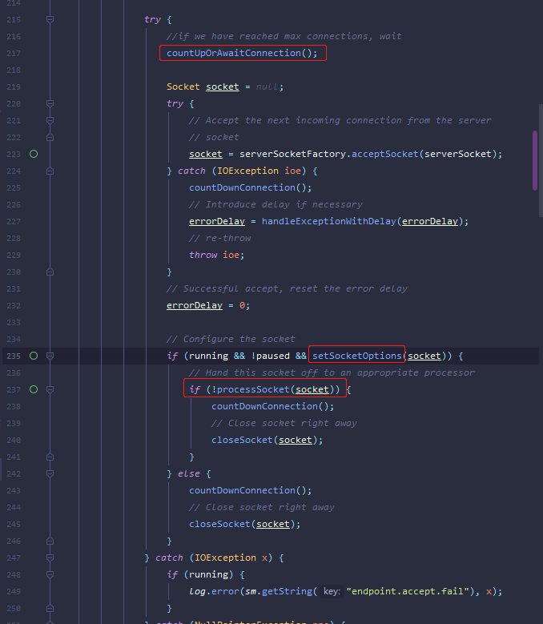
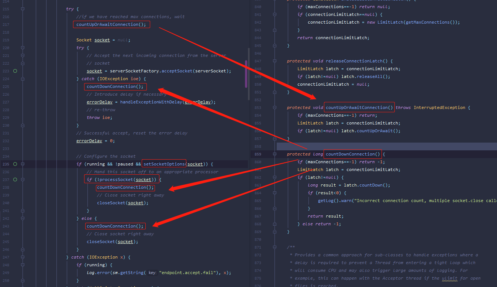
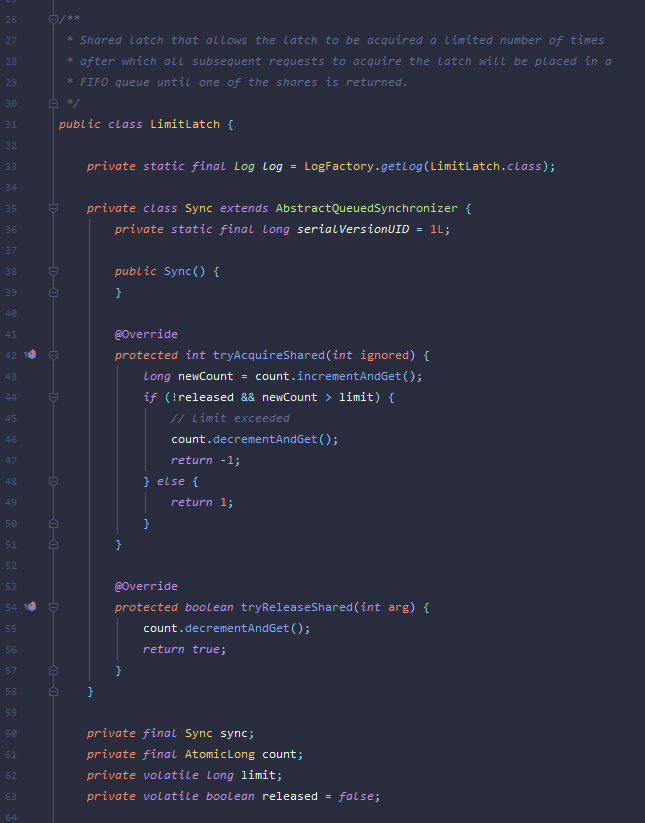
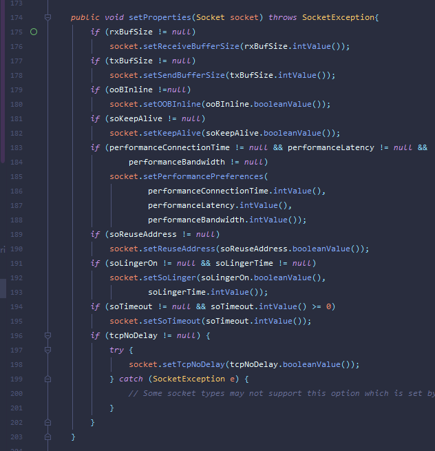

默认使用BIO的方式，对应的Endpont为JIOEndpoint

1. 由JIOEndpoint中的Acceptor接收socket请求，若请求没有达到并发上限则继续，否则则等待其他线程完成后方可继续。限流使用的是 LimitLatch ，其内部由AQS实现

2. 接收到socket后设置socket属性，如存活事件，超时事件，接收缓冲区大小，发送缓冲区大小等

3. 将socket包装为 SocketWrapper 后交由 SocketProcessor 处理，SocketProcessor在线程池中处理

## 
请求流程汇总

